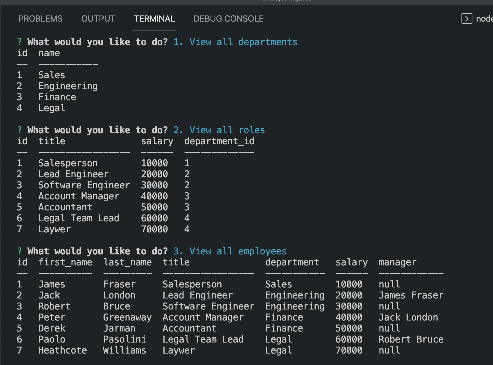

# Employee Organizer

## Description

This is a Content Management System (CMS) command-line application to manage a company's employee database, using Node.js, Inquirer, and MySQL

## Screenshot and Video

If you want visual instructions you can watch [this](https://watch.screencastify.com/v/cvs1a22Z2GIEgGGeO1l4)



## Table of Contents

- [Usage](#usage)
- [Liscence](#liscence)
- [Contributions](#contributions)
- [Questions](#questions)

## Usage

To start with, you will require Node.js, if you don't have it you can install it [here](https://nodejs.org/en/download/)

You will also need to install MySQL, installing it will require more than 1 step so you will need to look that up

Once you've opened up the project files in your code editor, open up your command line go to the root directory of the project and type `npm install` which will install all of the dependencies for you

Next, if you go to `/config/connection.js` you will find `process.env.DB_NAME, process.env.DB_USER, process.env.DB_PW`, these are your credentials, you can replace them with the database name ("employee_organizer_db"), your username and password. Make sure you have quotations around them. Alternatively you can create a `.env` file in the root directory and just write

```
DB_NAME='employee_organizer_db'
DB_USER='myUsername'
DB_PW='myPassword'
```

_If you're using a mac, don't forget to start the mySQL server by going to system preferences => mysql => Start_

The next step is to sign in to your mySQL account. You can do this by typing `mysql -u root -p` and then entering your password. Then type `source db/schema.sql` which will run the code in that file and create the database and seed the tables for you, if it doesn't work, double check to make sure you're in the right directory

You will notice that there are also `db.sql` and a `seeds.sql` files, normally you would have to type `source db/db.sql`, `source db/schema.sql`, `source db/seeds.sql` in that order and it will create an d USE the database, create the tables then seed it, I simply added the code from the other 2 into the `schema.sql` to save you some trouble, but if you don't want the seeded data then you can go ahead and delete those lines of code from the file. Now you can type `exit;` to exit out of mySQL since you need to be able to use your command line for the next steps

Now, in the command line type `npm run start` which will start the server

You will then see a list of options, you can view all of the departments, roles or employees. You can create a new department or role or you can update an employees information simply by using your keyboards up and down arrows to choose the option you want and hitting enter then answering any questions you are asked

When you are finished, you can go to option 8 `Finish` and hit enter and it will stop the server for you, of course all of your data will be saved in the database and unless you sign in to your database and run `db/schema.sql` then your data will naturally persist, of course if you want to delete all of that data, then you can do what I just mentioned

## Liscence

Not under any liscence

## Contributions

Made by Daniel Arzanipour

## Questions

[My Github](https://github.com/DanielArzani)

If you need to reach me for any additional questions, you can reach me at my [Gmail](mailto:daniel.arzanipour@gmail.com)
